# Cloudflare Zero Trust & Okta SSO Implementation

> Deployed a **segmented Zero Trust access layer** across the organization: **Cloudflare Zero Trust** (Tunnel + Access) to expose an internal Odoo ERP to remote employees without opening a public port, and **Okta SSO** to unify the developer toolchain (10 SaaS applications) behind a single SAML 2.0 identity with centralized off-boarding.

**Duration:** July 2025 – September 2025
**Role:** Cybersecurity Specialist (Sole Architect & Implementer)

---

## 📌 Overview

This project is the organization's Zero Trust access layer. It consists of **two parallel tracks**, each solving a different access problem for a different user group, with deliberately separated Identity Providers:

| Track | User Group | IdP | Target Services |
|---|---|---|---|
| **1. Cloudflare Zero Trust** | All employees | Microsoft Entra ID | Internal Odoo ERP (hosted on AWS) |
| **2. Okta SSO** | Developers | Okta | 10 developer SaaS applications |

### Why two Identity Providers?

The two user groups have fundamentally different needs:

- **General employees** already live inside Microsoft 365. Routing them through Microsoft Entra ID for Odoo access re-uses the MFA, Conditional Access, and lifecycle tooling that already governs their day-to-day. Adding a second IdP here would duplicate identity without adding value.
- **Developers** use a stack of tools (Jira, GitHub, AWS, ArgoCD, Grafana, …) that Microsoft Entra ID does not cover well. Okta's SaaS catalog and SCIM support fit the developer toolchain natively.

Choosing one IdP for both groups would have compromised either the Microsoft-integrated experience for employees **or** the developer SaaS coverage. Segmenting by user group keeps each surface on the IdP that fits it best.

---

## 🎯 Background

### Track 1: Cloudflare Zero Trust for Odoo

- **Remote access demand exploded** — business travel, remote work, and weather/natural-disaster disruptions (snow days, regional events) increasingly required employees to reach Odoo from outside the office.
- The historical posture kept Odoo **reachable only from the corporate network**. The only remote-access path was VPN, which added friction and had limited throughput.
- Opening Odoo directly to the internet was unacceptable — any public endpoint becomes a brute-force / credential-stuffing target.

### Track 2: Okta SSO for Developer Tooling

- The development team was using 10+ SaaS tools, each with its own account, its own credentials, and its own off-boarding path.
- When a developer left, **manual account deactivation across every service was required**, creating a window where residual access lingered.
- Developer onboarding was equally painful — each new hire needed 10 separate account provisioning actions.

### Goals
1. Expose Odoo to remote users **without a public port**, gated by Zero Trust policy.
2. Enforce **MFA** on every external Odoo access attempt.
3. Collapse the developer toolchain behind **one identity**, with one-click off-boarding.

---

## 🏗️ Architecture

### Track 1 — Cloudflare Zero Trust (Odoo)

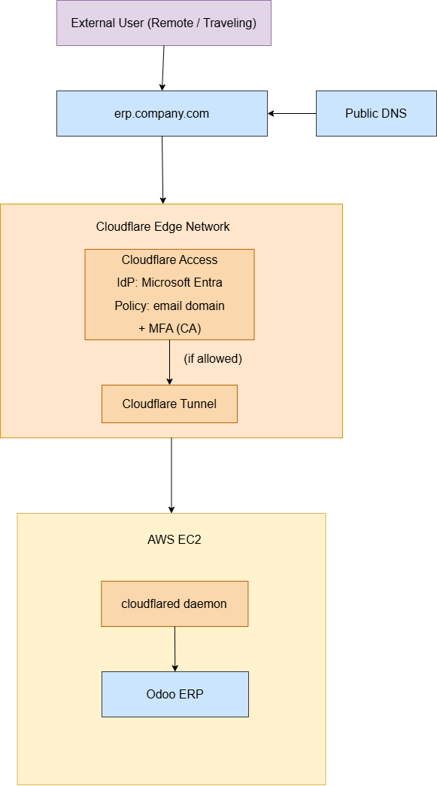

| Stage | Component | Role |
|---|---|---|
| 1 | **Cloudflare DNS** | `erp.<company>.com` resolves to Cloudflare's edge |
| 2 | **Cloudflare Access** | Intercepts the request; presents Microsoft Entra ID login |
| 3 | **Microsoft Entra ID** | Performs primary auth + MFA (Microsoft Authenticator) |
| 4 | **Access Policy** | Validates the user: email domain check **AND** MFA-completed session |
| 5 | **Cloudflare Tunnel** | If allowed, traffic flows through an outbound-only encrypted tunnel |
| 6 | **`cloudflared` daemon on AWS EC2** | Terminates the tunnel and forwards traffic to the local Odoo instance |
| 7 | **Odoo ERP** | Serves the application; uses Microsoft OAuth as its own login method so the final sign-in ties back to the same Entra identity |

Result: the Odoo EC2 instance has **no inbound public ports**. All traffic is outbound from the EC2 to Cloudflare.

### Track 2 — Okta SSO (Developer Toolchain)

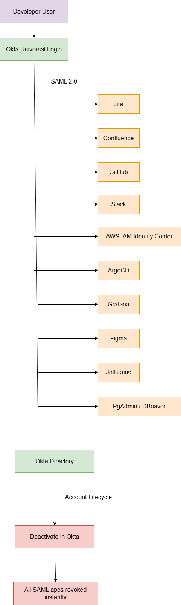

A developer authenticates once to Okta. Okta issues SAML 2.0 assertions to each downstream application:

| Service | Integration |
|---|---|
| Jira | SAML 2.0 |
| Confluence | SAML 2.0 |
| GitHub | SAML 2.0 |
| Slack | SAML 2.0 |
| AWS IAM Identity Center | SAML 2.0 |
| ArgoCD | SAML 2.0 |
| Grafana | SAML 2.0 |
| Figma | SAML 2.0 |
| JetBrains | SAML 2.0 |
| PgAdmin / DBeaver | SAML 2.0 |

The Okta directory is the **single source of truth for account state**. Deactivating a user in Okta revokes access to every downstream app on the next session refresh.

---

## 🛠️ Tech Stack

### Cloudflare Zero Trust
- **Cloudflare Access** — Identity-aware reverse proxy / application gateway
- **Cloudflare Tunnel (cloudflared)** — Outbound-only encrypted tunnel from origin to Cloudflare edge
- **Reusable Access Policies** — Domain allow-list + IdP MFA gate

### Identity
- **Microsoft Entra ID** — Primary IdP for Cloudflare Access (all employees)
- **Microsoft Authenticator** — MFA method, tenant-wide
- **Microsoft Conditional Access** — Enforces MFA on every sign-in that reaches Entra ID

### Okta
- **Okta Workforce Identity** — IdP for the developer toolchain
- **SAML 2.0** — Protocol for all 10 application integrations
- **Okta Directory** — Authoritative user store for SaaS off-boarding

### Infrastructure
- **AWS EC2** — Odoo ERP host
- **Odoo ERP** — Self-hosted ERP application; configured with Microsoft OAuth as an allowed login provider

---

## ⚙️ Implementation Details

### Track 1 — Cloudflare Zero Trust

#### Step 1.1 — Cloudflare Tunnel
- Installed the `cloudflared` daemon directly on the Odoo EC2 instance.
- Registered the tunnel in the Cloudflare dashboard and bound it to the Odoo hostname.
- Verified the tunnel established an outbound connection to Cloudflare edge without requiring inbound AWS security group rules.

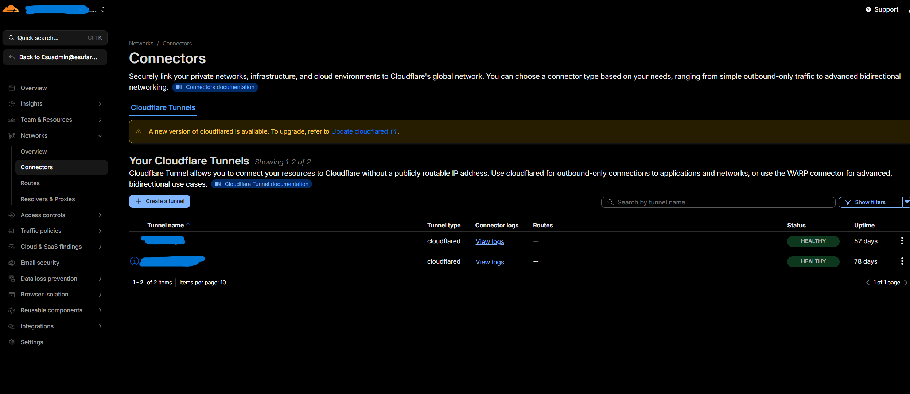

#### Step 1.2 — Cloudflare Access Application
- Created a self-hosted Access Application for the Odoo hostname.
- Attached Microsoft Entra ID as the Access IdP.

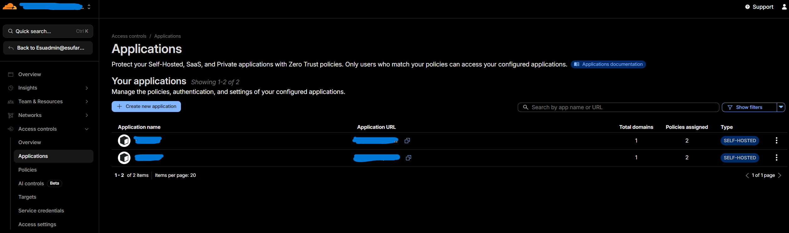

#### Step 1.3 — Reusable Access Policies

Three reusable policies govern who reaches Odoo:

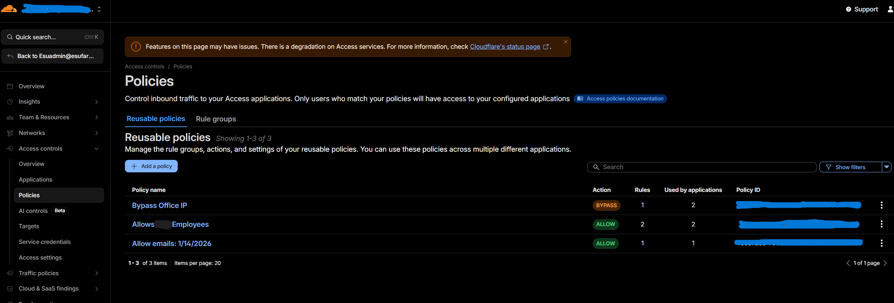

| Policy | Action | Purpose |
|---|---|---|
| **Bypass Office IP** | BYPASS | In-office traffic (from known egress IPs) skips the Access gate for low-friction internal use |
| **Allow Employees** | ALLOW | Authenticated via Entra ID + email domain matches the corporate domain |
| **Allow emails (specific list)** | ALLOW | Temporary / vendor access for specific external email addresses with an expiry date |

#### Step 1.4 — End-User Flow

When an external user hits the Odoo hostname:

1. **Odoo login page** appears, offering "Log in with Microsoft" as the sole external option.

   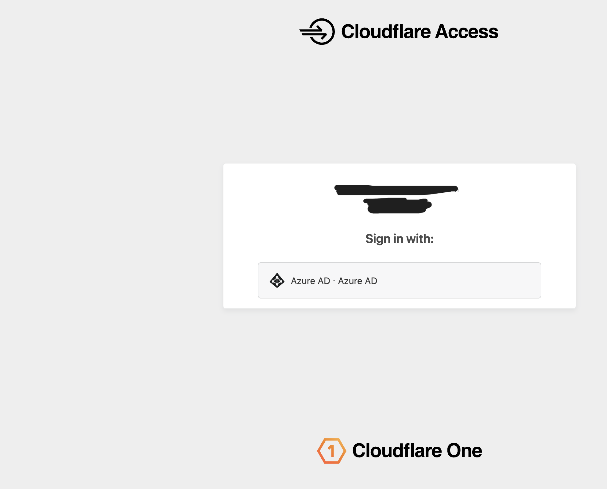

2. **Microsoft sign-in** prompts for the corporate account.

   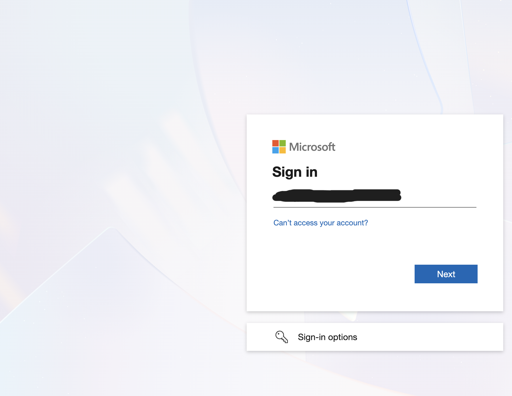

3. **Microsoft Authenticator push** — the user approves the MFA request.

   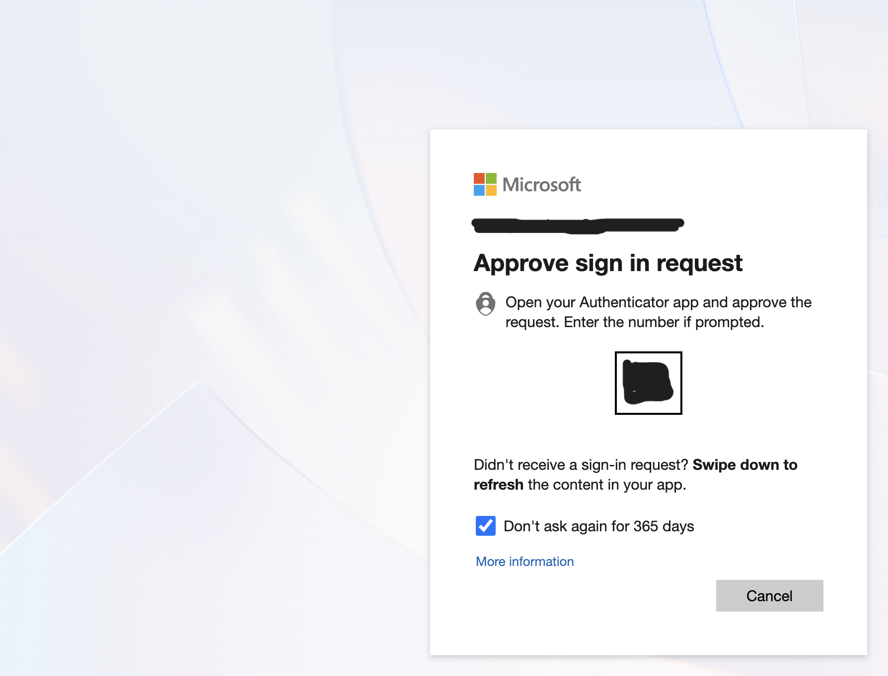

4. **Cloudflare Access IdP selection** — Azure AD (Entra ID) is presented as the backing IdP.

   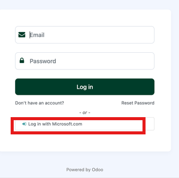

5. **Odoo dashboard** — access granted, user lands on the ERP.

   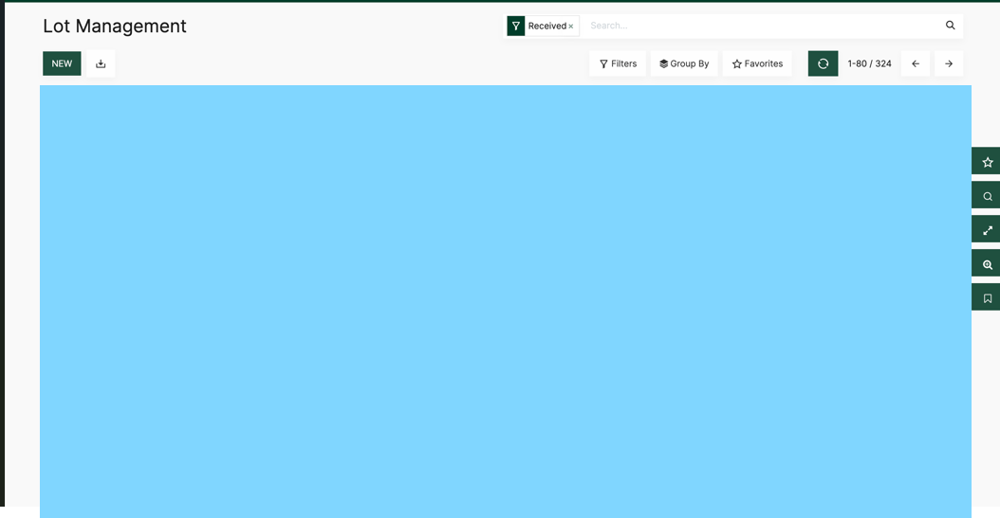

### Track 2 — Okta SSO

#### Step 2.1 — Okta Tenant Setup
- Provisioned an Okta tenant for the developer team (new deployment, not an extension of an existing IdP).
- Imported developer accounts and organized them into a single "Developers" group for application assignment.

#### Step 2.2 — Application Integrations

Each of the 10 SaaS tools was integrated via SAML 2.0:

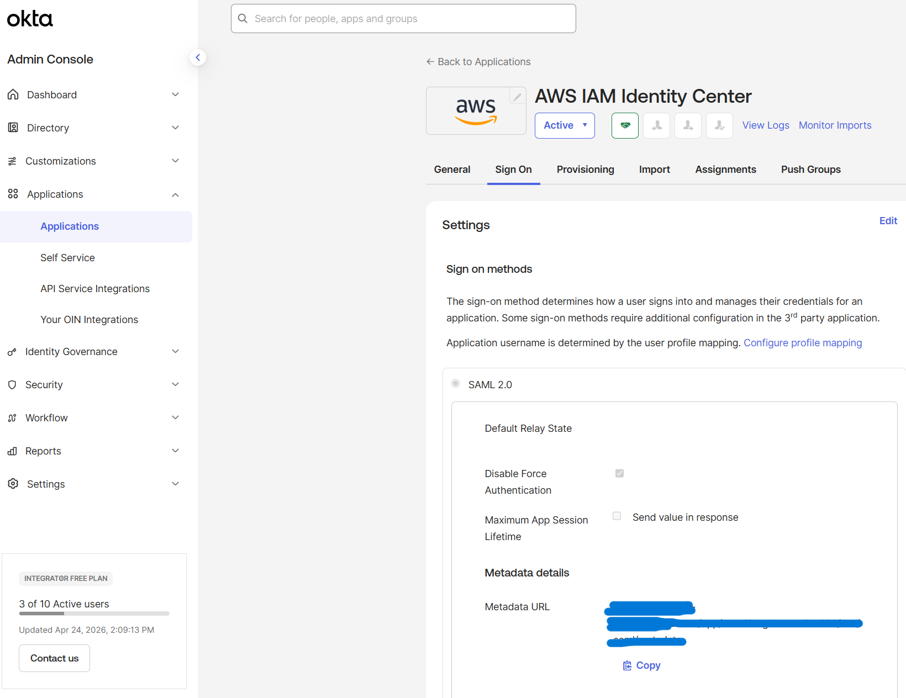
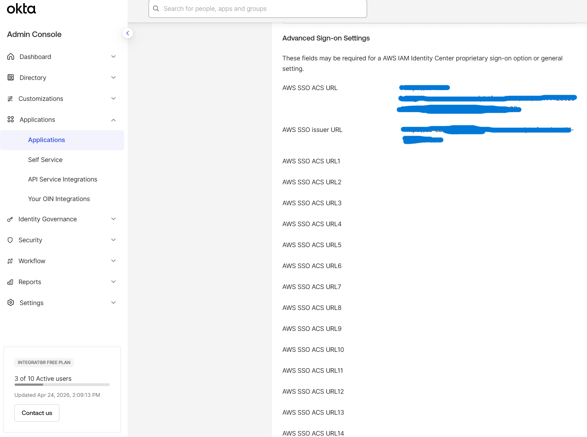
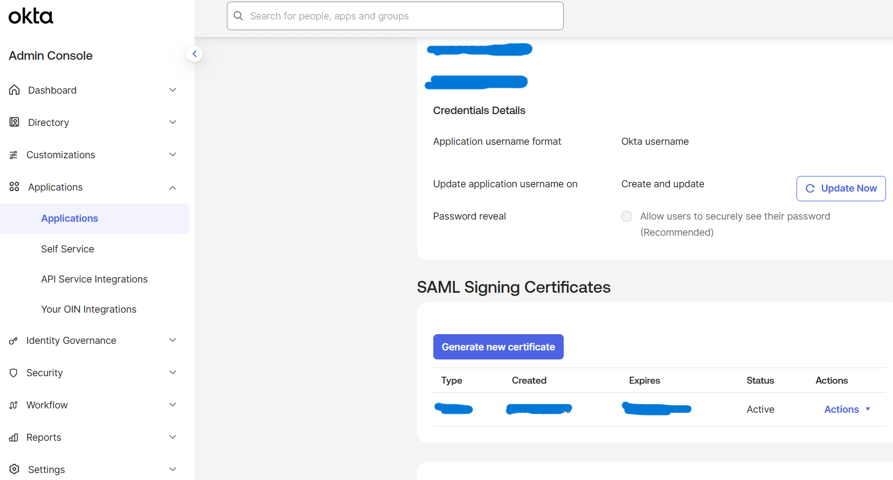

For each application:
1. Created a new App Integration in Okta with SAML 2.0.
2. Exchanged metadata (Okta metadata URL → target app; target app ACS URL → Okta).
3. Configured the signing certificate (SHA-256).
4. Assigned the "Developers" group.
5. Validated the login flow end-to-end.

#### Step 2.3 — Off-boarding Automation
- With Okta as the identity source of truth, developer off-boarding is a **single action**: deactivate the Okta user.
- On next session validation, every downstream SAML app denies access.
- This replaces what was previously a 10-step manual checklist per departing developer.

---

## 📐 Design Decision — Identity Provider Segmentation

Using two IdPs (Microsoft Entra ID for employees, Okta for developers) was a deliberate choice, not an accident of legacy sprawl. The reasoning:

**Microsoft Entra ID** is the natural choice for general employee access because the organization already runs on Microsoft 365. Every employee already has MFA enrolled through Microsoft Authenticator, every sign-in already passes through Conditional Access, and joiner/mover/leaver flows already run through Entra ID group membership. Routing Odoo access through anything else would have required duplicating that governance.

**Okta** is the natural choice for the developer toolchain because the developer SaaS stack — Jira, GitHub, AWS IAM Identity Center, ArgoCD, Grafana, Figma, JetBrains, and so on — is exactly what Okta's application catalog is built for. Microsoft Entra ID does have SAML support for many of these, but Okta's catalog coverage and setup experience for developer tools is materially better.

**The trade-off**: running two IdPs means two admin consoles and two MFA enrollment surfaces. In practice, this cost is contained because the two IdPs serve two non-overlapping user groups, and each group only ever interacts with one of them. The benefit — each user group living on the IdP that fits their workflow best — outweighs the minor operational overhead.

---

## 📈 Outcome

### Track 1 — Cloudflare Zero Trust
- **Zero inbound ports** on the Odoo EC2 instance; the origin is no longer internet-reachable.
- Remote employees access Odoo from anywhere with the same MFA-enforced flow used for every other corporate resource.
- **Every access attempt** is logged in the Cloudflare Access audit trail, tied to an Entra identity.
- In-office traffic bypasses the Access gate via trusted-IP policy, so employees on the corporate network see no added latency.

### Track 2 — Okta SSO
- One account, one password, one MFA policy for **10 developer applications**.
- Developer off-boarding reduced from a **10-step manual checklist** to a **single Okta deactivation**.
- Onboarding similarly simplified: add the new hire to the "Developers" group and they inherit all 10 applications.
- **Centralized audit** — every SaaS login is traceable back to the Okta directory.

---

## 🔐 Security Considerations

| Concern | Mitigation |
|---|---|
| Public exposure of Odoo origin | Cloudflare Tunnel — **outbound-only**; no inbound ports on EC2 |
| Unauthenticated access to Odoo | Cloudflare Access enforces IdP auth **before** traffic reaches origin |
| Weak primary auth | Entra ID + Microsoft Authenticator MFA required for every session |
| Domain impersonation | Access Policy validates email against corporate domain allow-list |
| Vendor / contractor access sprawl | Separate time-bound `Allow emails` policy for external users |
| Residual developer access after departure | Okta deactivation propagates to all 10 SAML apps on next session refresh |
| Credential reuse across dev tools | SSO removes per-service passwords entirely |
| SAML certificate compromise | SHA-256 signing certs with a 10-year rotation window planned in Okta |
| IdP outage blast radius | Two-IdP segmentation — an Entra ID outage does not affect developer tooling, and vice versa |

---

## 🚀 Future Improvements

- **SCIM provisioning** for the Okta-governed apps to move from authentication-only to full lifecycle automation (account creation + attribute sync, not only off-boarding).
- **Cloudflare WARP** deployment for developer laptops to extend Zero Trust to non-web services (SSH, database ports).
- **Device posture checks** in Cloudflare Access (require compliant Intune device in addition to identity).
- **Okta → Entra ID federation** for a hybrid case if any developer tool needs to be shared with non-developer staff.
- **Shorter Access session lifetimes** for high-sensitivity modules inside Odoo (Finance, HR) via app-level Access Policies.

---

## 📁 Repository Structure

```
.
├── README.md
├── diagrams/
│   ├── cloudflare-zero-trust.png
│   ├── cloudflare-zero-trust.drawio
│   ├── okta-sso.png
│   └── okta-sso.drawio
└── screenshots/
    ├── cloudflare-applications.png
    ├── cloudflare-tunnels.png
    ├── cloudflare-policies.png
    ├── flow-1-odoo-login.png
    ├── flow-2-microsoft-signin.png
    ├── flow-3-mfa-approve.png
    ├── flow-4-cloudflare-access.png
    ├── flow-5-odoo-dashboard.png
    ├── okta-aws-saml.png
    ├── okta-saml-advanced.png
    └── okta-saml-certs.png
```

---

## ⚠️ Disclaimer

This documentation describes the architecture, design decisions, and workflow only. All domains, tenant identifiers, policy IDs, certificate metadata, employee names, and company-identifying branding have been redacted or replaced with placeholders. Screenshots are sanitized copies; no credentials, access tokens, or internal hostnames are included.

---

## 👤 Author

**Changjae Chung** — Cybersecurity Specialist
🔗 [LinkedIn](https://www.linkedin.com/in/changjae-chung-374821176)
